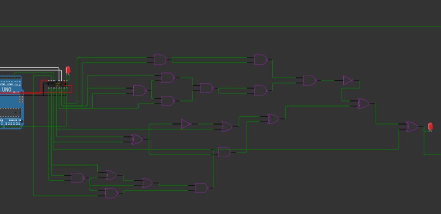
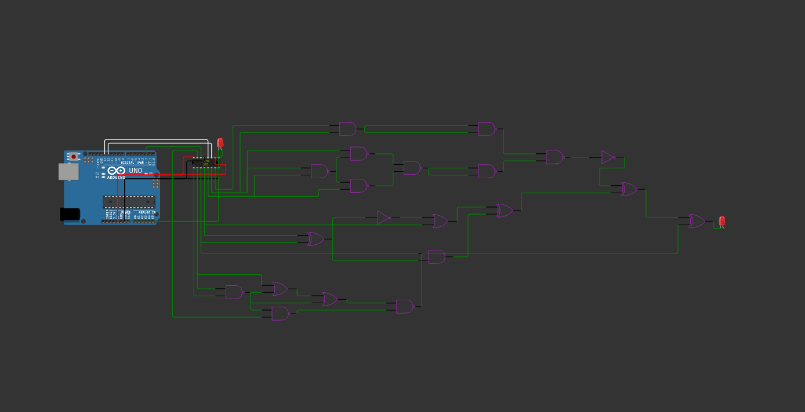
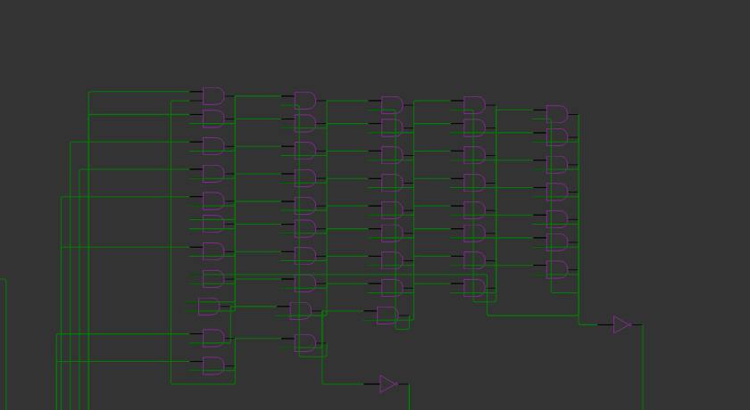
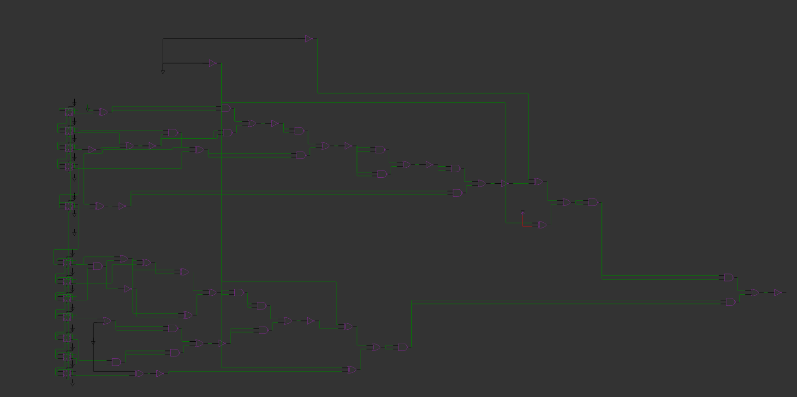

# Solution
This document provides the solution for the challenge: "Digital Electronics III".

## Acknowledgement
I would like to thank Jabriel Seah from Nanyang Polytechnic for the initial inspiration for this challenge, the "Nandy & Nory" challenge of Lag and Crash CTF.

His challenge can be found [here](https://github.com/SpeedFox198/CTF-Writeups/blob/main/Authored/2023-04-14%20Lag%20and%20Crash%203.0/Nandy%20%26%20Nory/README.md)

Although this challenge is inspired by his, I have not contacted him as it will reveal challenge details and render this challenge invalid.

## Working Program
```cpp
#include<Arduino.h>

int srClock1 = 12;
int rClock1 = 13;
int data1 = 2;

void updateShiftRegister(unsigned int value)
{
   digitalWrite(rClock1, LOW);
   digitalWrite(srClock1, LOW);
   Serial.println("write val" + String(value));
   shiftOut(data1, srClock1, LSBFIRST, value);
   digitalWrite(rClock1, HIGH);
}


void setup() {
  // put your setup code here, to run once:
  Serial.begin(115200);

  pinMode(srClock1, OUTPUT);
  pinMode(rClock1, OUTPUT);
  pinMode(data1, OUTPUT);

  digitalWrite(rClock1, LOW);      // (11) ST_CP [RCK] on 74HC595
  digitalWrite(srClock1, LOW);      // (9) SH_CP [SCK] on 74HC595
  digitalWrite(data1, LOW);

  pinMode(10, OUTPUT); // Reset Pin
  // 0b10 -> 1
  // 0b00 -> 0
  // PGT. So we switch to 0 first.
  // 10011101

  digitalWrite(10, 1);
    digitalWrite(10, 0);


  for (uint16_t i=0; i<=0b011110110101; i++) {
    updateShiftRegister(0b00);

    updateShiftRegister(0b10);
    Serial.println(i,BIN);
  }

  Serial.println("Setup complete.");
}

void loop() {
}


```

## Parser program (Z3)
```py

from z3 import And, Bool, Not, Or, Solver, solve, Xor, simplify, sat, BoolRef, Bool
import json
def Nand(a, b):
    return Not(And(a, b))

def Nor(a, b):
    return Not(Or(a, b))


with open("diagram.json", "r") as f:
    f_contents = f.read()
    f_json = json.loads(f_contents)


# Store the gates by the output, not the input.
gates = {}

def add_to_gate(key, entry):
    if key in gates:
        gates[key].append(entry)
    else:
        gates[key] = [entry]


# 1 NAND should have 2 inputs. (give as hint)
#    [ "sr1:Q7", "nand16:A", "green", [ "v0" ] ], // input, output, don't need to care
# this is the connections only.
# we add the gates first.

accepted_types = ["wokwi-gate-nand-2", "wokwi-gate-or-2", "wokwi-gate-xor-2", "wokwi-gate-not", "wokwi-gate-and-2" ]

for part in f_json["parts"]:
    if part["type"] in accepted_types:
        gates[Bool(part["id"])] = []


sources = ["Q7", "Q6", "Q5", "Q4", "Q3", "Q2", "Q1", "Q0"]
start_alt = ['flop1', 'flop2', 'flop3', 'flop4', 'flop5', 'flop6', 'flop7', 'flop8', "flop9","flop10","flop11","flop12","flop13","flop14","flop15","flop16"]
for source in sources:
    gates[Bool(source)] = []
for source in start_alt:
    gates[Bool(source)] = []


start_types = ["OUT", *sources, "GND", "VCC"]
source_types = ["sr1", "gnd", *start_alt]
end_types = ["IN", "A", "B"]

for connection in f_json["connections"]:
    # Connections may be swapped.
    # OUT is for start of the connection
    # IN(NOT only), A, B is for end of the connection
    # sr1: is start of the connection
    # We store stuff using the end of the connection with ID only, not A or B.
    end_1 = connection[0]
    end_2 = connection[1]

    # check end_1
    tmp = end_1.split(":")
    print("tmp", tmp)
    start = -1j
    if tmp[1] in start_types or tmp[0] in source_types:
        start = end_1
    elif tmp[1] in end_types:
        end = end_1
    else:
        print("Part not recognised", end_1, end_2, tmp[1])
        continue
    print("tmp", tmp)

    tmp = end_2.split(":")
    if tmp[1] in start_types or tmp[0] in source_types:
        if start != -1j:
            print("DOUBLE START! SKIPPING!")
            continue
        start = end_2
    elif tmp[1] in end_types:
        end = end_2
    else:
        print("Part not recognised", end_1, end_2)
        continue

    # If no such gate, we delibrately raise an exception
    start_split = start.split(":")
    print("start split", start_split, start_split[0] in start_alt)
    if start_split[0] in start_alt:
        start_id = start_split[0]
    elif start_split[0] in source_types:
        start_id = start_split[1]
    else:
        start_id = start_split[0]

    end_id = end.split(":")[0]

    gates[Bool(end_id)].append(Bool(start_id))


print("Gates formed is", gates)
source = [Bool("Q7"), Bool("Q6"), Bool("Q5"), Bool("Q4"), Bool("Q3"), Bool("Q2"), Bool("Q1"), Bool("Q0"), Bool("flop1"), Bool("flop2"), Bool("flop3"), Bool("flop4"), Bool("flop5"), Bool("flop6"), Bool("flop7"), Bool("flop8"),Bool("flop9"),Bool("flop10"),Bool("flop11"),Bool("flop12"),Bool("flop13"),Bool("flop14"),Bool("flop15"),Bool("flop16")]
# Which NAND is the output?
# in this case its NAND13.
def trace(gate):
    if gate in source:
        print("BASE CASE", gate)
        return gate # Base case, which is the inputs itself.
    strgate = str(gate)
    if strgate.startswith("gnd"):
        return False
    elif strgate.startswith("vcc"):
        return True


    connected = gates[gate]
    print("CONNECTED", gate, connected, len(connected))
    if len(connected) == 0:
        print("NO ITEMS IN LIST!!!!!!!!!!!!!!!!!!!!!!!!!!!!!!!!!!!!!!!!!!")

    if strgate.startswith("nand"):
        return Nand(trace(connected[0]), trace(connected[1]))
    elif strgate.startswith("or"):
        return Or(trace(connected[0]), trace(connected[1]))
    elif strgate.startswith("not"):
        return Not(trace(connected[0]))
    elif strgate.startswith("xor"):
        return Xor(trace(connected[0]), trace(connected[1]))
    elif strgate.startswith("and"):
        return And(trace(connected[0]), trace(connected[1]))
    else:
        raise Exception(f"Not implemented: {gate}")


a = trace(Bool("xor1")) # ENTER THE FINAL GATE HERE!
print(a)
print("simplification", simplify(a))
solver = Solver()
solver.add(a == True)
if solver.check() == sat:
    print("RESULT")
    model = solver.model()
    print(model, type(model), dir(model), model.model)
    sorted_model = sorted ([(x, model[x]) for x in model], key = lambda x: str(x[0]))
    print(sorted_model)

else:
    print("Unsatisfiable")


```


## Steps
1. This challenge can be split into 2 parts.
### 1st part: xor1 output


2. We see a shift register connected to pins 2, 12, and 13.
3. We can create a function to update the output of the shift register:
```cpp
void updateShiftRegister(unsigned int value)
{
   digitalWrite(rClock1, LOW);
   digitalWrite(srClock1, LOW);
   Serial.println("write val" + String(value));
   shiftOut(data1, srClock1, LSBFIRST, value);
   digitalWrite(rClock1, HIGH);
}
```

A shift register is basically a device that takes in serial input and outputs parallel output.
Arduino provides APIs to handle shift registers and their clocks. We shall use them.
4. We still need to determine the input value needed.
We shall copy the 1st part to another Wokwi project, then take the `diagram.json` from it.

```json
{
  "version": 1,
  "author": "Anonymous maker",
  "editor": "wokwi",
  "parts": [
    {
      "type": "wokwi-arduino-uno",
      "id": "uno1",
      "top": 10.200000000113999,
      "left": -58.199999999885996,
      "attrs": {}
    },
    {
      "type": "wokwi-74hc595",
      "id": "sr1",
      "top": 27.600000000114,
      "left": 303.040000000114,
      "attrs": {}
    },
    {
      "type": "wokwi-gate-nand-2",
      "id": "nand1",
      "top": 374.400000000114,
      "left": 364.800000000114,
      "attrs": {}
    },
    {
      "type": "wokwi-gate-or-2",
      "id": "or1",
      "top": 364.800000000114,
      "left": 489.600000000114,
      "attrs": {}
    },
    {
      "type": "wokwi-gate-nand-2",
      "id": "nand2",
      "top": 432.00000000011397,
      "left": 489.600000000114,
      "attrs": {}
    },
    {
      "type": "wokwi-gate-or-2",
      "id": "or2",
      "top": 393.600000000114,
      "left": 624.000000000114,
      "attrs": {}
    },
    {
      "type": "wokwi-gate-nand-2",
      "id": "nand3",
      "top": 412.800000000114,
      "left": 825.600000000114,
      "attrs": {}
    },
    {
      "type": "wokwi-gate-xor-2",
      "id": "xor1",
      "top": 182.400000000114,
      "left": 1612.800000000114,
      "attrs": {}
    },
    {
      "type": "wokwi-gate-xor-2",
      "id": "xor2",
      "top": 96.000000000114,
      "left": 1430.400000000114,
      "attrs": {}
    },
    {
      "type": "wokwi-gate-not",
      "id": "not1",
      "top": 9.600000000114,
      "left": 1372.800000000114,
      "attrs": {}
    },
    {
      "type": "wokwi-gate-nand-2",
      "id": "nand4",
      "top": 9.600000000114,
      "left": 1228.800000000114,
      "attrs": {}
    },
    {
      "type": "wokwi-gate-xor-2",
      "id": "xor3",
      "top": 153.600000000114,
      "left": 1094.400000000114,
      "attrs": {}
    },
    {
      "type": "wokwi-gate-or-2",
      "id": "or3",
      "top": 182.400000000114,
      "left": 921.600000000114,
      "attrs": {}
    },
    {
      "type": "wokwi-gate-and-2",
      "id": "and1",
      "top": 278.400000000114,
      "left": 912.000000000114,
      "attrs": {}
    },
    {
      "type": "wokwi-gate-nand-2",
      "id": "nand5",
      "top": -67.199999999886,
      "left": 1046.400000000114,
      "attrs": {}
    },
    {
      "type": "wokwi-gate-nand-2",
      "id": "nand6",
      "top": 48.000000000114,
      "left": 1046.400000000114,
      "attrs": {}
    },
    {
      "type": "wokwi-gate-and-2",
      "id": "and2",
      "top": -67.199999999886,
      "left": 672.000000000114,
      "attrs": {}
    },
    {
      "type": "wokwi-gate-nand-2",
      "id": "nand7",
      "top": 38.400000000114,
      "left": 844.8000000001141,
      "attrs": {}
    },
    {
      "type": "wokwi-gate-nand-2",
      "id": "nand8",
      "top": 1.1399947652535047e-10,
      "left": 700.8000000001141,
      "attrs": {}
    },
    {
      "type": "wokwi-gate-nand-2",
      "id": "nand9",
      "top": 86.40000000011399,
      "left": 700.8000000001141,
      "attrs": {}
    },
    {
      "type": "wokwi-gate-nand-2",
      "id": "nand10",
      "top": 48.000000000114,
      "left": 595.2000000001141,
      "attrs": {}
    },
    {
      "type": "wokwi-gate-not",
      "id": "not2",
      "top": 172.80000000011398,
      "left": 768.000000000114,
      "attrs": {}
    },
    {
      "type": "wokwi-gate-xor-2",
      "id": "xor4",
      "top": 230.400000000114,
      "left": 585.600000000114,
      "attrs": {}
    },
    {
      "type": "wokwi-led",
      "id": "led1",
      "top": -32.399999999886,
      "left": 359.00000000011397,
      "attrs": { "color": "red" }
    },
    {
      "type": "wokwi-led",
      "id": "led2",
      "top": 178.80000000011398,
      "left": 1712.600000000114,
      "attrs": { "color": "red" }
    }
  ],
  "connections": [
    [ "sr1:VCC", "uno1:5V", "red", [ "h-28.8", "v49.2", "h-176.6" ] ],
    [ "sr1:GND", "uno1:GND.3", "black", [ "v28.8", "h-259.2" ] ],
    [ "sr1:MR", "uno1:5V", "red", [ "v20.4", "h28.8", "v26.4", "h-291.8" ] ],
    [ "sr1:OE", "uno1:GND.3", "black", [ "v10.8", "h-48", "v48", "h-163.2" ] ],
    [ "sr1:STCP", "uno1:13", "white", [ "v-46.8", "h-278.4" ] ],
    [ "sr1:SHCP", "uno1:12", "white", [ "v-37.2", "h-278.4" ] ],
    [ "sr1:Q2", "nand1:A", "green", [ "v0" ] ],
    [ "sr1:Q1", "nand1:B", "green", [ "v0" ] ],
    [ "sr1:Q2", "or1:A", "green", [ "v288", "h163.2" ] ],
    [ "nand1:OUT", "or1:B", "green", [ "v0" ] ],
    [ "nand1:OUT", "nand2:A", "green", [ "v0" ] ],
    [ "or1:OUT", "or2:A", "green", [ "v0" ] ],
    [ "or2:OUT", "nand3:A", "green", [ "v0" ] ],
    [ "nand2:OUT", "nand3:B", "green", [ "v0" ] ],
    [ "nand1:OUT", "or2:B", "green", [ "v0" ] ],
    [ "xor2:OUT", "xor1:A", "green", [ "v0" ] ],
    [ "not1:OUT", "xor2:A", "green", [ "v28.8", "h-67.2", "v38.4" ] ],
    [ "nand4:OUT", "not1:IN", "green", [ "v0" ] ],
    [ "xor3:OUT", "xor2:B", "green", [ "v0" ] ],
    [ "or3:OUT", "xor3:A", "green", [ "v0" ] ],
    [ "and1:OUT", "xor3:B", "green", [ "h38.4", "v-115.2" ] ],
    [ "nand5:OUT", "nand4:A", "green", [ "v0" ] ],
    [ "nand6:OUT", "nand4:B", "green", [ "v0" ] ],
    [ "and2:OUT", "nand5:A", "green", [ "v0" ] ],
    [ "and2:OUT", "nand5:B", "green", [ "v0" ] ],
    [ "nand7:OUT", "nand6:A", "green", [ "v0" ] ],
    [ "nand7:OUT", "nand6:B", "green", [ "v0" ] ],
    [ "nand8:OUT", "nand7:A", "green", [ "v0", "h105.6" ] ],
    [ "nand9:OUT", "nand7:B", "green", [ "v0", "h48" ] ],
    [ "nand10:OUT", "nand8:B", "green", [ "v0" ] ],
    [ "nand10:OUT", "nand9:A", "green", [ "v0" ] ],
    [ "sr1:Q7", "and2:A", "green", [ "v57.6", "h48", "v-9.6" ] ],
    [ "sr1:Q6", "and2:B", "green", [ "v67.2", "h76.8", "v-153.6" ] ],
    [ "sr1:Q6", "nand10:A", "green", [ "v67.2", "h96", "v-67.2" ] ],
    [ "sr1:Q6", "nand8:A", "green", [ "v67.2", "h96", "v-115.2" ] ],
    [ "sr1:Q5", "nand10:B", "green", [ "v76.8", "h124.8", "v-57.6" ] ],
    [ "sr1:Q5", "nand9:B", "green", [ "v76.8", "h297.6", "v-19.2" ] ],
    [ "not2:OUT", "or3:A", "green", [ "v0" ] ],
    [ "xor4:OUT", "and1:B", "green", [ "v0" ] ],
    [ "xor4:OUT", "not2:IN", "green", [ "v0" ] ],
    [ "sr1:Q4", "xor4:A", "green", [ "v0" ] ],
    [ "sr1:Q3", "xor4:B", "green", [ "v0" ] ],
    [ "sr1:Q4", "or3:B", "green", [ "v153.6", "h585.6" ] ],
    [ "sr1:Q3", "and1:A", "green", [ "v0" ] ],
    [ "sr1:Q7S", "led1:A", "green", [ "h0" ] ],
    [ "led1:C", "uno1:GND.3", "green", [ "v0" ] ],
    [ "uno1:2", "sr1:DS", "green", [ "v-19.2", "h148.1" ] ],
    [ "nand3:OUT", "xor1:B", "green", [ "v-144", "h384" ] ],
    [ "sr1:Q0", "nand2:B", "green", [ "v-18", "h-67.2", "v384" ] ],
    [ "xor1:OUT", "led2:C", "green", [ "v0" ] ]
  ],
  "dependencies": {}
}
```
5. We can parse the diagram using a SAT solver like Z3.
Enter the final gate ID, `not1` into the above program and run it.

You shall get a possible output. Since the 1st stage has multiple possible positions Z3 will output one of them.

```
output 0 -> 0b0
output 1 -> 0b10
```

6. We see that the output of the 1st stage is connected to a sequence of D Flip Flops.
They are a binary counter, activated on the Positive Going Transition of the output of 1st stage.
So when the output of 1st stage changes from 0 -> 1, the output of binary counter increases by 1.
If we want to get the output of the binary counter to the desired value, we have to increment it by 1 each time.
A reset is done at the start as initial configuration is arbitrary.

7. We shall copy the 2nd stage to a new Wokwi project and parse it again.

8. We shall see that Z3 is stuck in an infinite loop. This is because there are AND gates with outputs chained to inputs.


By simulation, or knowledge of AND gates, we know that these AND gates are basically a distraction. They will only output logic LOW.
We thus replace it with a GND symbol. There are 2 such instances of such devices in the circuit.



9. Parse it with Z3. We get the following result:
```
[flop10 = True,
 flop7 = False,
 flop2 = False,
 flop1 = True,
 flop9 = True,
 flop11 = True,
 flop5 = True,
 flop3 = True,
 flop4 = False,
 flop12 = False,
 flop8 = True,
 flop6 = True]
 ```
Order it from MSB (flop12) to LSB (flop1).
`011110110101`.

10. Increment 0b011110110101 times.

You can use the updateShiftRegister method to trigger a PGT for 0b011110110101 times.
```cpp

  for (uint16_t i=0; i<=0b011110110101; i++) {
    updateShiftRegister(0b00);
    updateShiftRegister(0b10);
    Serial.println(i,BIN);
  }
```

11. Print "Setup complete."
