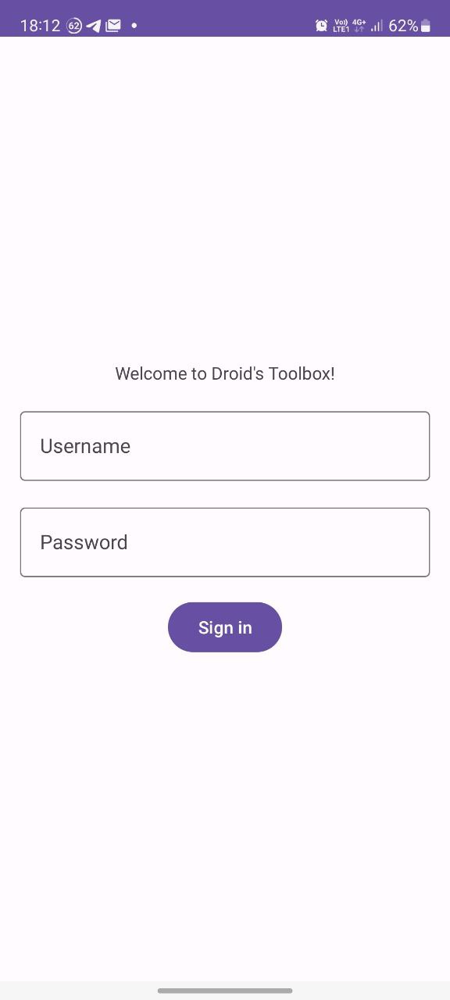
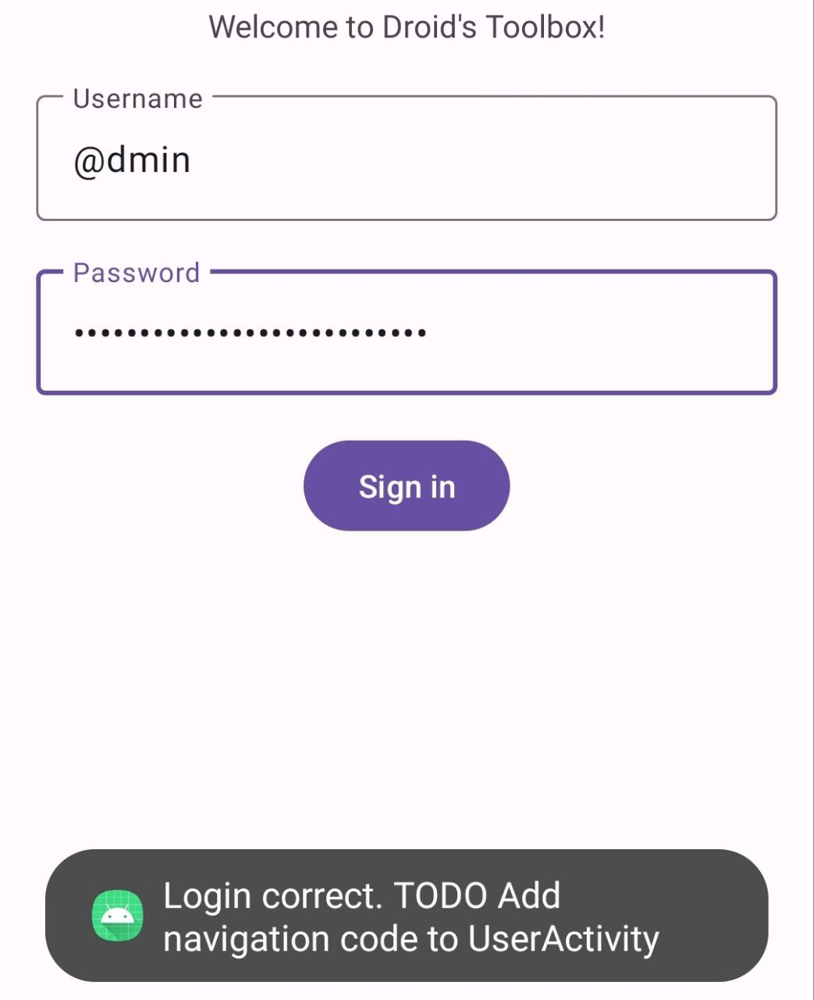
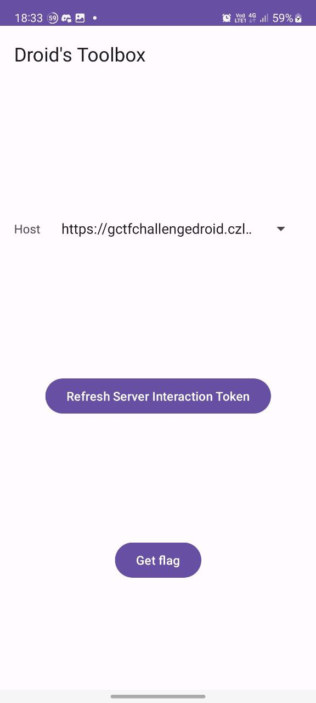

# Solution
Here is the solution for the challenge: Droid's Toolbox.  
This challenge can be solved in multiple ways (I will mention them), but this writeup will focus on one of them.

## Steps

1. Download the APK and install it on a device. It is to be expected that most CTF Players will just do 1.3(including me, the challenge author), but that is fine as they can always come back without having to disassemble the app again, and it is intended.
Because of step 12, we should re-sign the APK with a certificate that we own. This is of utmost importance.
1.1. Generate a keystore 
With `keytool` it can be something like `keytool -genkey -v -keystore my-release-key.keystore -alias alias_name -keyalg RSA -keysize 2048 -validity 10000`. 
1.2 Resign the APK file  
This can be done with Android's [APK Signer](https://developer.android.com/tools/apksigner), which is part of the standard Android SDK installation. 
```bash
zipalign -p -f -v 4 droid-toolbox.apk new.apk
apksigner sign --ks my-release-key.keystore new.apk
```
1.3 Download the APK
`adb install new.apk`

2. You will be presented with this login screen.


3. To gain access to credentials, we shall decompile the application.  
Use [Dex2Jar](https://github.com/pxb1988/dex2jar) to get a JAR file from the APK.  
Afterwards, you can use a JAR disassembler like [Procyon](https://github.com/mstrobel/procyon) to dump the JAR classes as text files in your directory. This will produce readable Java files we can read. Open this directory in the editor of your choice.
Alternatively, you may use [JADX](https://github.com/skylot/jadx).
> [!NOTE] 
> The application is written in Kotlin and compiled to the Android JVM.

Sample CLI output:
```bash
cheezihanlucius on czluciusPC.local code/challc/gctf
❯ d2j-dex2jar.sh droid-toolbox.apk
dex2jar droid-toolbox.apk -> ./droid-toolbox-dex2jar.jar


cheezihanlucius on czluciusPC.local code/challc/gctf
❯ java -jar procyon-decompiler-0.6.0.jar droid-toolbox-dex2jar.jar -o droid-toolbox
Decompiling android/support/v4/app/INotificationSideChannel...
Decompiling android/support/v4/os/IResultReceiver...
Decompiling android/support/v4/os/ResultReceiver...
Decompiling androidx/activity/ActivityViewModelLazyKt...
Decompiling androidx/activity/Api19Impl...
Decompiling androidx/activity/Api26Impl...
Decompiling androidx/activity/Cancellable...
Decompiling androidx/activity/FullyDrawnReporter...
Decompiling androidx/activity/FullyDrawnReporterKt...
Decompiling androidx/activity/FullyDrawnReporterOwner...
Decompiling androidx/activity/OnBackPressedCallback...
Decompiling androidx/activity/OnBackPressedDispatcher...
Decompiling androidx/activity/OnBackPressedDispatcherKt...
Decompiling androidx/activity/PipHintTrackerKt...

```

4. The app package name is `dev.czlucius.gctf23challenge`, so we shall navigate to `<path>/dev/czlucius/gctf23challenge`  
In `MainActivity.java`, there is this line (somewhere around line 40):
```java
if (Intrinsics.areEqual(string, "@dmin") && Intrinsics.areEqual(string2, "f62264b387396e88b28766bbf5bbe8ec5623")) {
```
We can see that the username is `@dmin` and the password is `f62264b387396e88b28766bbf5bbe8ec5623`.
Using this, we can log in to the application.

5. We are presented with a screen that says the developer has not added navigation code to UserActivity. This is intentional.


6. We shall inspect the manifest of the application.  
Usually users can skip this step in the interest of time and launch the activity directly, its just to show that the activity indeed exported.


You can either:
- Open the APK in Android Studio (File -> Profile/Debug APK)
- Download one of the popular "Package Manager" apps from the Play Store ([example](https://play.google.com/store/apps/details?id=com.smartpack.packagemanager))

Upon analysis, we see the activity:
```xml
        <activity
            android:theme="@ref/0x7f10023e"
            android:label="@ref/0x7f0f00a9"
            android:name="dev.czlucius.gctf23challenge.UserActivity"
            android:exported="true" />
```

It has the attribute `exported="true"`. This means that the activity can be launched from other applications.
> [!NOTE]
> Without this, it is impossible to launch the activity.


7. Launch the activity
The user can proceed to launch the activity. The user can use ADB (`adb shell am start -n "dev.czlucius.gctf23challenge/dev.czlucius.gctf23challenge.UserActivity"`) or use one of the popular "Activity Launcher" apps on the Play Store ([example](https://play.google.com/store/apps/details?id=de.szalkowski.activitylauncher))

8. We are presented with this screen. We can choose the host from a list of options.


9. We shall press "Refresh Server Interaction Token"  
What this does is send a POST request to the server with the user's FCM token.  
The server replies with the Server Interaction Token via Firebase Cloud Messaging(confirmed by the toast message "Token Received!").  
Internally, the token is stored with `SharedPreferences`, and encrypted via the Android Keystore (RSA)

> [!NOTE]
> It is sent via FCM so that people will not use the URL directly with tools like Postman, and have to use an Android client.  
> This is one of the possible alternative methods of solving the challenge:  
> Extracting the Firebase API keys from the client app, and building a new app to receive those keys, then using the key in Postman.
> Firebase's API **may** (not verified) support loading of external Firebase projects not specified in the google-services.json.
> A proficient CTF player can extract the API keys from the APK.
> More information can be found [here](https://stackoverflow.com/questions/62253691/firebasemessaging-getinstancefirebaseapp-for-secondary-app-supposed-to-be-publ)
> However, this solution has not been verified, and the correctness of the solution is unknown.

10. We shall press "Get flag". We are presented with a dialog showing the encrypted flag.  
This is an RSA 2048 bit encrypted flag. 
**Copy this flag and store it well.**

11. A brief explanation on architecture.
- The server has 2 endpoints, `/sendAuthorizationToken` and `/flag`.
- This challenge depends on the [Android Keystore System](https://developer.android.com/training/articles/keystore), which is a security feature of Android.
    - It is able to create RSA key pairs in a secure environment, and store them securely as well.
    - You cannot access the private key for decryption, you can only decrypt information via the APIs.
    - This is like the TPM modules of AMD64 chips, or the Secure Enclave on Apple chips.
    - On devices like the Google Pixel, there is a seperate chip (Titan M) which will handle these keys, and it will be extremely difficult, if not impossible, to extract the keys even if the attacker has physical access to the device.
- The user requests the Server Interaction Token, and it is returned and encrypted with a key from the Android Keystore. Hence even if we have access to the internals of the app we cannot get the raw token and it must go through the app decryption process.
- The user then sends a POST request to `/flag` with their Server Interaction Token in the headers (`Bearer <token>`), and the body being `{publicKey: <PEM format public key of the RSA key pair created>}`
- The encrypted flag with that public key is returned. This is why a Server Interaction Token is needed, else users will be able to just query the endpoint with their own keys, defeating the purpose of this as a mobile challenge.


> [!NOTE]
> Users can extract the private key on **insecure, rooted devices**(No Trusted Execution Environment too). The devices can be emulators as well, as long as they have Google Play Services.
> One such emulator available is Genymotion, which advertises rooting capabilities (which can be enabled).
> This is also an alternative approach CTF players can take. See `/data/misc/keystore/user_0` or `persistent.sqlite` (Android 9+)

The flag retrieval method we are going to use is this:

12. (For the majority of the CTF players) Upon inspection of the APK, it was signed with a custom key. Users who realise this at this step must complete steps 1.1 and 1.2, and perform a fresh install (wiping previous data), and complete the subsequent steps. 

13. With a key we control, we can use it to sign new updates to the application which have access to the **application keystore**.

14. From the disassembly (CipherTools.java) we can deduce that the keystore entry name is `CTF_TOOLBOX_3716` and the cipher type is `RSA/ECB/OAEPwithSHA-1andMGF1Padding`

14. We can create a new project in Android Studio with the same package name (`dev.czlucius.gctf23challenge`)  
A very simple sample app project is provided, you can go check in `Decryptor.zip`  
Then we can access the keystore.  

Sample MainActivity (need the corresponding layout file):
```java
package dev.czlucius.gctf23challenge

import androidx.appcompat.app.AppCompatActivity
import android.os.Bundle
import android.util.Base64
import android.widget.Button
import android.widget.EditText
import java.nio.charset.Charset
import java.security.KeyStore
import javax.crypto.Cipher

class MainActivity : AppCompatActivity() {
    override fun onCreate(savedInstanceState: Bundle?) {
        super.onCreate(savedInstanceState)
        setContentView(R.layout.activity_main)
        val enc = findViewById<EditText>(R.id.enc)
        val decBtn = findViewById<Button>(R.id.decbtn)
        decBtn.setOnClickListener {
            val keyStore = KeyStore.getInstance("AndroidKeyStore")
            keyStore.load(null)
            var entry = keyStore.getEntry("CTF_TOOLBOX_3716", null)
            val privKey = (entry as KeyStore.PrivateKeyEntry).privateKey
            val cipher = Cipher.getInstance("RSA/ECB/OAEPwithSHA-1andMGF1Padding")
            cipher.init(Cipher.DECRYPT_MODE, privKey)
            val rawEncrypt = Base64.decode(enc.text.toString(), Base64.DEFAULT)
            enc.setText(cipher.doFinal(rawEncrypt).toString(Charset.defaultCharset()))

        }
    }

}
```


15. Sign an APK of the new application (Build>Generate Signed Bundle/APK) with our signature. (.keystore)

16. Install the APK

17. Paste the key from step 10 (assuming no uninstalls were made), and press "decrypt".

18. The flag is obtained: `GCTF23{AndR01D_Is_S0_Fun!_f9fee49985}`
