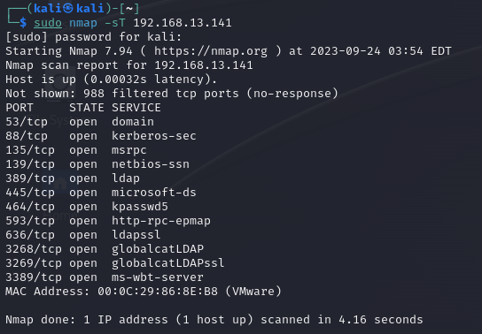
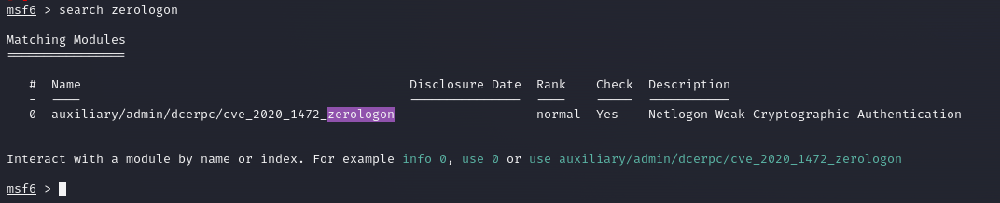
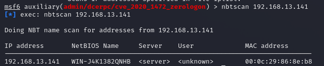
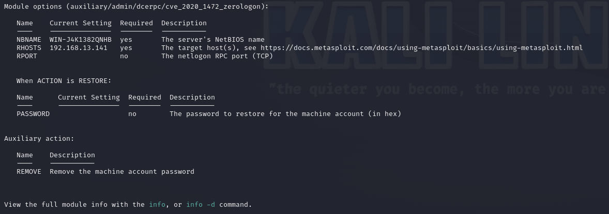
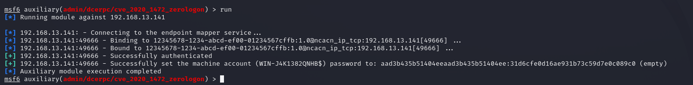
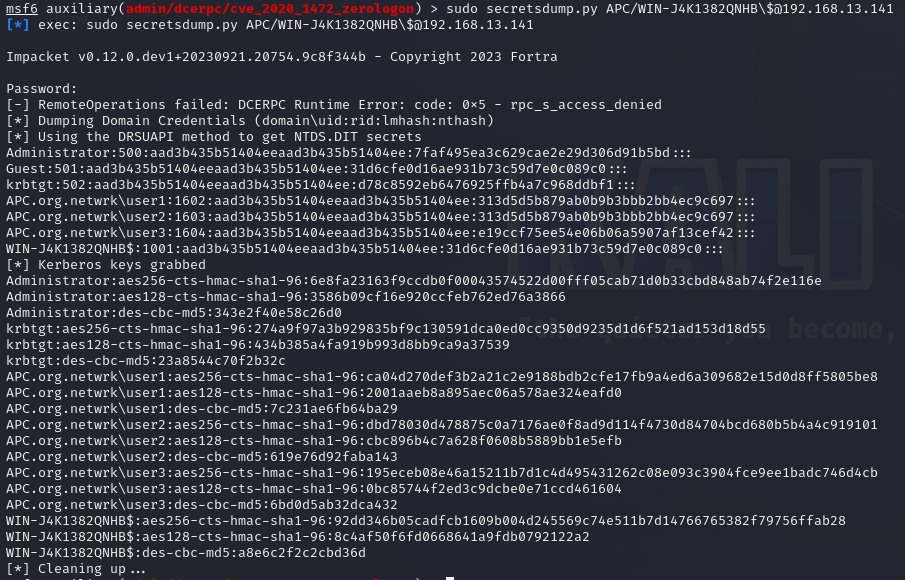
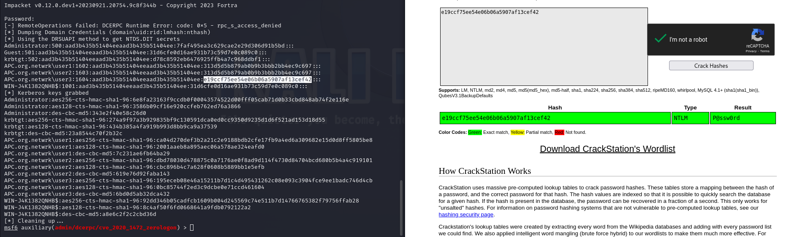
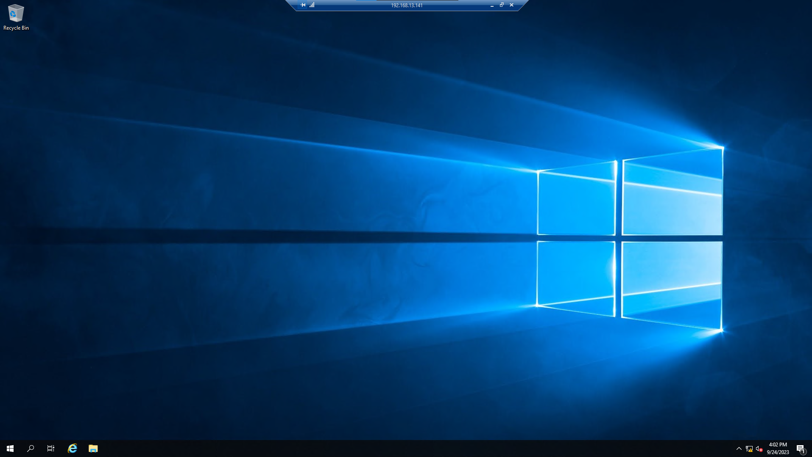
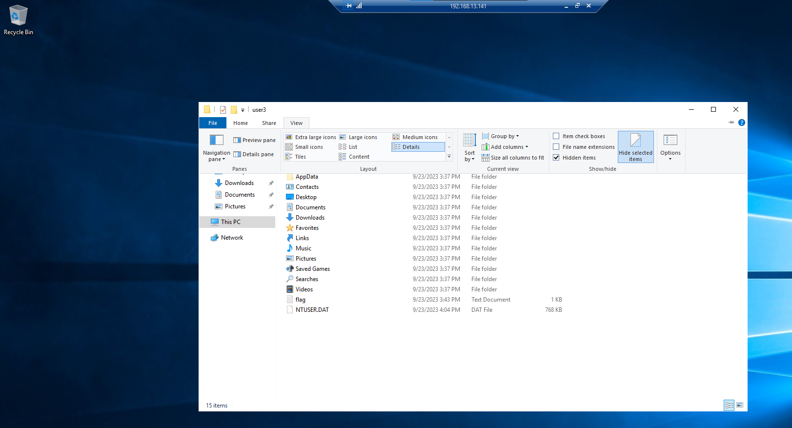

## Challenge Name
-  APC Corp
## Challenge Difficulty
- Easy
## Challenge Category
- pwn 
## Challenge Description
We have infiltrated into APC corp network, we would like to take over APC corp's domain controller, could you help us find a user with comprimised password?

# Writeup
Using nmap to scan machine and realising it is a DC (LDAP,kpassword5)

Using Metasploit to attack machine using ZeroLogon

Scanning host to check for netbios name

Adding name into msf to set the exploit into action

Once Done, use secretsdump.py (impacket) to export password hashes

Use Crackstation to find weak password

Use RDP (TCP 3389) to connect to Domain Controller (DC) using the stolen credentials

Find the Hidden flag inside of user's folder

# solution
Attack windows server 2019 with CVE-2020-1472 to dump NTLM hash and use crackstation to determine user3 password and sign in using remote desktop and find flag through user directory hidden file

