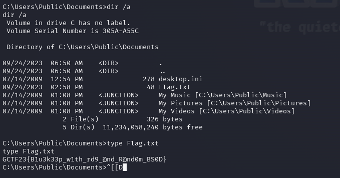

## Challenge Name
-  PDS Corp
## Challenge Difficulty
- Easy
## Challenge Category
- pwn 
## Challenge Description
PDS Corp has commited war crimes in the Afghanistan war and has commited mass genocide and is in violation of the geneve convetion. Evidence of such wrong doings are on this workstation. We have infiltrated into PDS's Corprate Network (Shitty Firewall) Kindly attack this workstation remotely. (Kindly Use the Included Version of Virtual Box)
# Writeup
Scan Using NMAP and notice Windows 7 SP1 has RDP enabled (Port 3389)

Use CVE-2019-0708 to attack the machine

Look for hidden txt file in system with shell

# solution
Attack windows 7 SP1 Machine with CVE-2019-0708(Codenamed BlueKeep) to obtain system level access and find flag through user directory hidden file.

