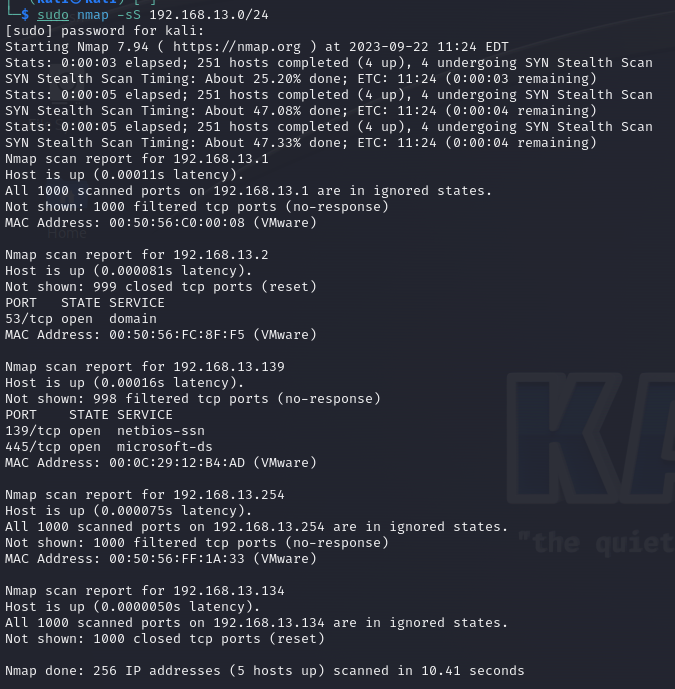
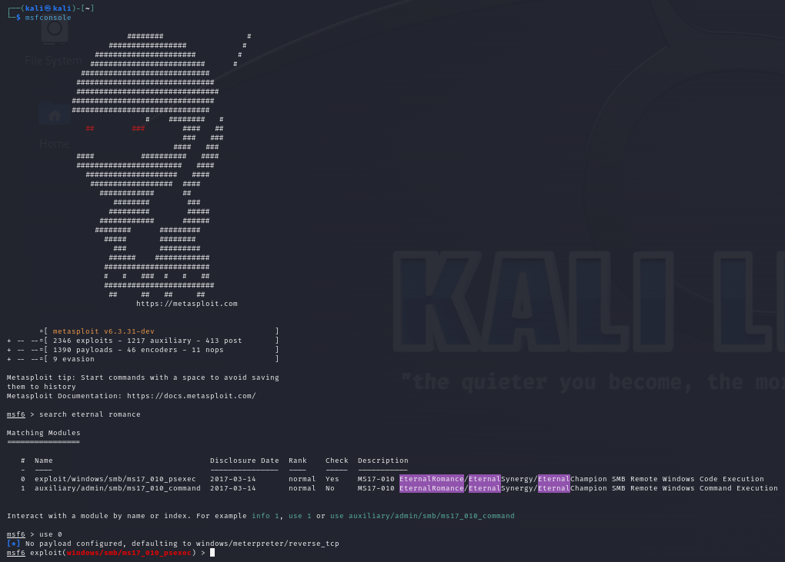
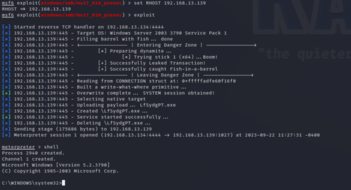
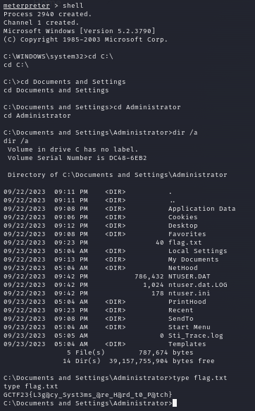

## Challenge Name
-  RSM Corp
## Challenge Difficulty
- Easy
## Challenge Category
- pwn 
## Challenge Description
You have infiltrated the network of RSM Corp (MNC) that so happens the be using a WINDOWS SERVER 2003 STANDARD. On that server are client records that are stored "Securely". Retrieve the information from the server so we can start blackmailing the company.

# Writeup
Scan Using NMAP

Once Identified that Port 445 is open use metasploit console to exploit eternal blue (eternal romance)

Find the Hidden file

# solution
Nmap stealth scan the windows server 2023 (see that they have smb enabled) using metasploit console attack the machine using eternal romance (eternalblue) and find the hidden file inside the directory.

