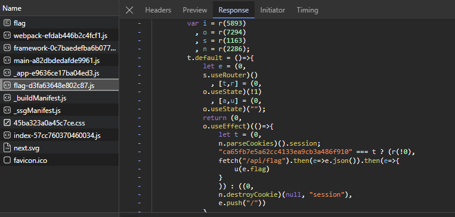
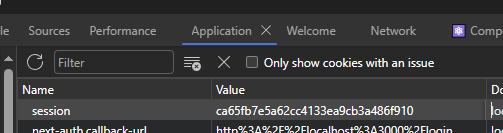

# Solution

When trying to access the /flag url, you are redirected by default back to the login page

But looking at the network tab of developer tools (on the browser) we can see the js thats parsed to load the page, and the session cookie its checking for before loading the flag

Setting the cookie "session" as ca65fb7e5a62cc4133ea9cb3a486f910 will then allow users to see the flag in /flag

which is GCTF2023{nExT_jS_1s_4w3s0m3}
