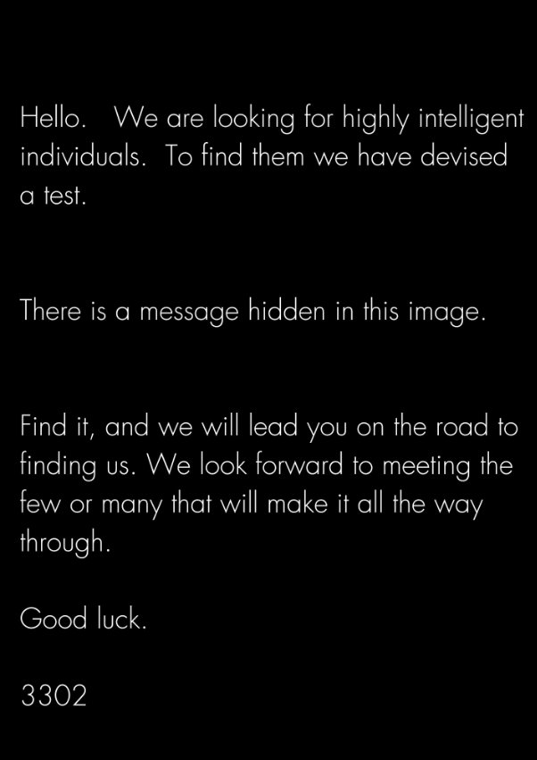

Gryphons Cyberchallenge

Title:circada 3302

Name of creator:Nicholas yeo
Discord handle in case challenge breaks:bigboyfluffynickfishman

Description:**Cicada 3301** is a nickname given to three sets of [puzzles](https://en.wikipedia.org/wiki/Puzzle) posted under the name "3301" online between 2012 and 2014. The first puzzle started on January 2, 2012, on [4chan](https://en.wikipedia.org/wiki/4chan)[\[1\]](https://en.wikipedia.org/wiki/Cicada_3301#cite_note-DT-1) and ran for nearly a month. A second round of puzzles began one year later on January 4, 2013, and then a third round following the confirmation of a fresh clue posted on [Twitter](https://en.wikipedia.org/wiki/Twitter) on January 4, 2014.[\[2\]](https://en.wikipedia.org/wiki/Cicada_3301#cite_note-2)[\[3\]](https://en.wikipedia.org/wiki/Cicada_3301#cite_note-3) The third puzzle has yet to be solved. The stated intent was to recruit "intelligent individuals" by presenting a series of puzzles to be solved; no new puzzles were published on January 4, 2015. A new clue was posted on Twitter on January 5, 2016.[\[4\]](https://en.wikipedia.org/wiki/Cicada_3301#cite_note-4)[\[5\]](https://en.wikipedia.org/wiki/Cicada_3301#cite_note-5) Cicada 3301 posted their last verified [OpenPGP](https://en.wikipedia.org/wiki/OpenPGP)-signed message in April 2017, denying the validity of any unsigned puzzle.[\[6\]](https://en.wikipedia.org/wiki/Cicada_3301#cite_note-threat_stack_website-6)

The puzzles focused heavily on [data security](https://en.wikipedia.org/wiki/Data_security), [cryptography](https://en.wikipedia.org/wiki/Cryptography), [steganography](https://en.wikipedia.org/wiki/Steganography), and internet anonymity.[\[7\]](https://en.wikipedia.org/wiki/Cicada_3301#cite_note-mentalfloss-7)[\[8\]](https://en.wikipedia.org/wiki/Cicada_3301#cite_note-WashingtonTimesErnst-8)[\[9\]](https://en.wikipedia.org/wiki/Cicada_3301#cite_note-Telegraph2-9) It has been called "the most elaborate and mysterious puzzle of the internet age",[\[10\]](https://en.wikipedia.org/wiki/Cicada_3301#cite_note-metro-10) and is listed as one of the "top 5 eeriest, unsolved mysteries of the internet" by [*The Washington Post*](https://en.wikipedia.org/wiki/The_Washington_Post),[\[11\]](https://en.wikipedia.org/wiki/Cicada_3301#cite_note-11) and much speculation exists as to its function. Many have speculated that the puzzles are a recruitment tool for the [NSA](https://en.wikipedia.org/wiki/NSA), [CIA](https://en.wikipedia.org/wiki/CIA),[\[12\]](https://en.wikipedia.org/wiki/Cicada_3301#cite_note-:2-12) [MI6](https://en.wikipedia.org/wiki/MI6), a "[Masonic conspiracy](https://en.wikipedia.org/wiki/Masonic_conspiracy)",[\[13\]](https://en.wikipedia.org/wiki/Cicada_3301#cite_note-13) or a cyber mercenary group.[\[1\]](https://en.wikipedia.org/wiki/Cicada_3301#cite_note-DT-1)[\[7\]](https://en.wikipedia.org/wiki/Cicada_3301#cite_note-mentalfloss-7) Others have stated Cicada 3301 is an [alternate reality game](https://en.wikipedia.org/wiki/Alternate_reality_game), although no company or individual has attempted to monetize it.[\[10\]](https://en.wikipedia.org/wiki/Cicada_3301#cite_note-metro-10) Some of the final contestants believe that Cicada 3301 is a remnant of the late 1980s and 1990s [Cypherpunk](https://en.wikipedia.org/wiki/Cypherpunk) movement.[\[14\]](https://en.wikipedia.org/wiki/Cicada_3301#cite_note-14)

[wikipedia cicada 3301]

Cicada 3301 is back baby but this time it needs you to solve a cybersecurity challenge under the gryphons lets get right into it oh yeah and we took alot of inspiration from the last cicada challenge so definitely use that knowledge I just shared to ur advantage ok good luck

Category:Forensics,Cryptography and OSINT

Difficulty level:easy

Actual legit attachment

Documentation:

1\.so far just steghide extract it using the command steghide extract -sf We\_meet\_again.jpg

2\.After u steghide it u should see a .txt file which says this 

3\.Immediately when u look at it u should think of using a cipher one could be the vigenere cipher if we apply the vigenere cipher to this it would become like this 

4\.Huh a website link we should go there….And We are greeted with this website

5\.Now I realise we need to inspect and delete these commented out sections

6\.After you get press on it a file should download that will be the image file we are looking at

7\. what the ok this is weird.The Image file actually has something called “broken file headers”(smth I learned at YCEP).To solve this we need file signatures for .png files and locate the png file header

8\.After locating it you have to go to the website Hexed.it to do change the broken file header to the string of hexadecimal we found in this Wikipedia thing 

` `9.Now we save it

10\.Now who is this fishman 22?

11\.We find that it is actually a Instagram account thru your osint skills

12\. And there is one post lets click on that post

13\.Whoa that’s hexadecimal lets pull up an ascii to hexadecimal decoder

14\.Now we got our flag

Flag: GCTF23{W3lcome\_T0\_C1rCad4}
